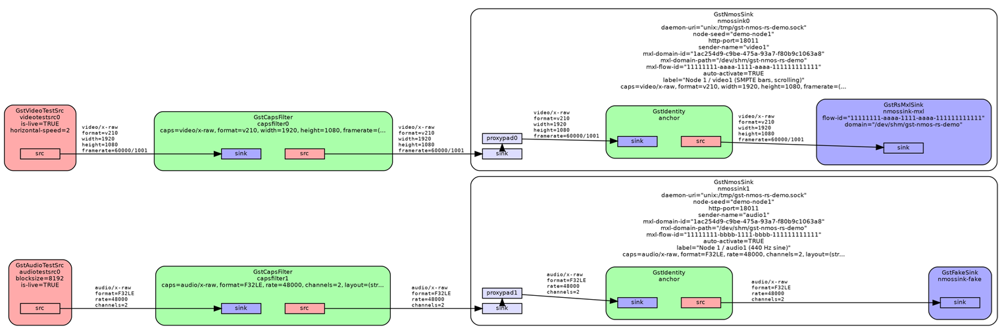
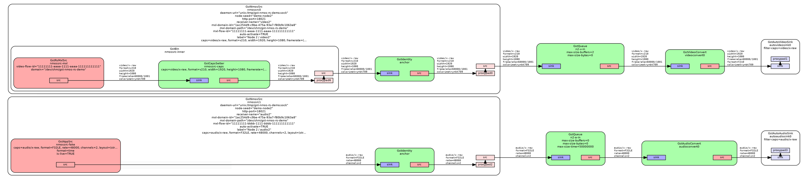
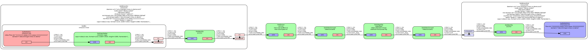
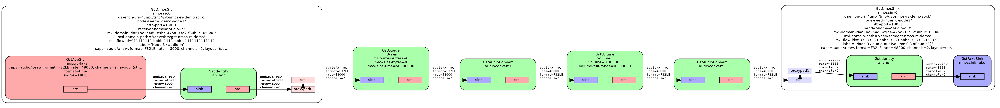

<!--
SPDX-FileCopyrightText: Copyright (c) 2026 NVIDIA CORPORATION & AFFILIATES. All rights reserved.
SPDX-License-Identifier: Apache-2.0
-->

# gst-nmos-rs

GStreamer plugin (`nmos`) providing the `nmossrc` and `nmossink` elements,
talking to the `nvnmosd` NMOS daemon over gRPC. Design lives in
[`doc/designs/nvnmosd/README.md`](../../doc/designs/nvnmosd/README.md);
the workspace overview is in [`../README.md`](../README.md).

The [Core NvNmos Concepts](https://nvidia.github.io/nvnmos/md_doc_2user_2concepts.html)
guide explains the transport file, activation direction, and identity model
shared by the GStreamer elements, C API, and daemon.

## Property Surface

Set via the standard `prop=value` syntax in `gst-launch-1.0`.

Both elements:

| Property         | Type    | Required? | Notes |
| ---------------- | ------- | --------- | ----- |
| `daemon-uri`     | string  | optional  | gRPC endpoint. Only `unix:/path/to/sock` is currently supported. Default `unix:/tmp/nvnmosd.sock`. |
| `node-seed`      | string  | required  | NvNmos Node seed; sessions sharing this seed share a Node. |
| `http-port`      | uint (0–65535) | optional  | TCP port for libnvnmos's NMOS HTTP APIs (`node_config.http_port`). `0` (the default) asks `nvnmosd` to allocate from `NVNMOSD_HTTP_PORT_MIN`..`NVNMOSD_HTTP_PORT_MAX`. Non-zero selects an explicit port (rejected when unavailable). Honoured only by the `OpenSession` that actually creates the Node; ignored when attaching to a pre-existing Node. The effective port is returned in `OpenSessionResponse.http_port`. |
| `host-name`      | string  | optional  | NMOS Node host name (`node_config.host_name`). Empty (the default) leaves libnvnmos to autodetect. Honoured only by the `OpenSession` that creates the Node. |
| `domain`         | string  | optional  | DNS domain for NMOS network services (`network_services.domain`). Use `local` to force mDNS. Empty (the default) leaves libnvnmos on automatic discovery. **Not** the MXL Domain — see `mxl-domain-id` / `mxl-domain-path`. Honoured only by the `OpenSession` that creates the Node. |
| `registration-url` | string | optional | Fixed IS-04 Registration API URL (`http://host[:port]/x-nmos/registration/v<X.Y>[/]`). Parsed into `network_services.registration_*`; invalid URLs are logged and ignored. Empty (the default) leaves libnvnmos on DNS-SD discovery based on `host-name`. Honoured only by the `OpenSession` that creates the Node. |
| `system-url`     | string  | optional  | Fixed IS-09 System API URL (`http://host[:port]/x-nmos/system/v<X.Y>[/]`). Parsed into `network_services.system_*`; invalid URLs are logged and ignored. Honoured only when `registration-url` is also set (libnvnmos ignores a standalone System API). Honoured only by the `OpenSession` that creates the Node. |
| `transport`      | enum    | required  | Inner data path family: `mxl` (MXL shared-memory, the `mxlsrc` / `mxlsink` chain), `udp` (ST 2110 over RTP/UDP via gst-plugins-good `udpsrc` / `udpsink` + the `rtp*pay` / `rtp*depay` line-up), `udp2` (same but preferring gst-plugins-rs's `udpsrc2` + `rtp*pay2` / `rtp*depay2` where available, falling back to gst-plugins-good per-element), `nvdsudp` (ST 2110 via DeepStream `nvdsudpsrc` / `nvdsudpsink` — Rivermax kernel-bypass, built-in RTP (de)payload, Mode 3; requires ConnectX-5+ and the Rivermax SDK). |
| `transport-file` | string  | route-dependent | Literal contents of the NvNmos transport file the daemon attaches via AddSender / AddReceiver: MXL `flow_def` JSON for `transport=mxl`, SDP text for `transport=udp` / `udp2` / `nvdsudp`. Pass text, not a path. Convenient for programmatic callers; gst-launch users want `transport-file-path` instead. Mutually exclusive with `transport-file-path`. May be substituted by `caps` (+ `mxl-flow-id` on MXL, or `transport-caps` and the IS-05 endpoint properties — `destination-ip` / `destination-port` / `interface-ip` / `multicast-ip` / `source-ip` / `source-port` — on RTP) on either element. |
| `transport-file-path` | string | route-dependent | Filesystem path read at NULL→READY into `transport-file`. Convenience for `gst-launch-1.0`, whose pipeline parser doesn't cope with multi-line / quote-heavy property values. Mutually exclusive with `transport-file`. |
| `label`          | string  | optional  | NMOS label for this Sender/Receiver (not the Node). Overrides the transport file when both are supplied (MXL `flow_def` top-level `label`; SDP `s=` line). |
| `description`    | string  | optional  | NMOS description for this Sender/Receiver. Overrides the transport file when both are supplied (MXL `flow_def` top-level `description`; SDP `i=` line). |
| `group-hint`     | string  | optional  | NMOS group hint (`urn:x-nmos:tag:grouphint/v1.0`), e.g. `"SDI 1:Video"`, used by controllers to group a device's Senders/Receivers (the related video, audio and ANC flows). Becomes the session-level `a=x-nvnmos-group-hint:` SDP attribute on RTP/UDP, or the grouphint tag in an MXL `flow_def`. Overrides the transport file when both are supplied. Omitted from synthesised files when unset. |
| `caps`           | GstCaps | required when `transport-file*` is unset | Essence caps describing the media format. Drives transport file synthesis when `transport-file*` is unset; cross-checked against a supplied transport file when both are set. See [supported essence shapes](#caps-essence-shapes) below. |
| `transport-caps` | GstCaps | optional  | RTP-only transport-layer overrides applied to the synthesised or supplied SDP, expressed as an `application/x-rtp` caps structure. Recognised fields: `payload` (dynamic RTP payload type, 96–127), `clock-rate` (audio only — video / ANC are pinned to 90000), `ptime` / `maxptime` (audio packetisation interval in ms, packed into SDP `a=ptime:` / `a=maxptime:`). Ignored on `transport=mxl`. |
| `transport-properties` | GstStructure | optional | Overrides applied to the inner source or sink (`udpsrc` / `udpsink` / `nvdsudpsrc` / `nvdsudpsink` / `mxlsrc` / `mxlsink`) every time the data-path chain is built. Pass a `GstStructure` whose fields are GObject property names on that inner element — for example `properties,buffer-size=26214400` or `properties,gpu-id=0,sync=false`. The structure name is not interpreted. Takes effect on the next chain build, not immediately on the one currently in the chain. Unknown fields log a warning and are skipped. |
| `mxl-domain-path` | string | required for MXL | Local filesystem path identifying the MXL Domain on this host; fed into the inner `mxlsink` / `mxlsrc` `domain=` property. If a `domain_def.json` is present in the directory its `id` is used to populate or cross-check `mxl-domain-id` (mismatch is an error — this is host-level identity). |
| `auto-activate`  | boolean | optional, default `false` | When `false` the element adds the Sender or Receiver to the daemon so it appears on IS-04 and IS-05 but leaves the inner data path on the fake chain until an IS-05 PATCH activates it (`master_enable: true` on `/single/{senders,receivers}/{id}/active`). When `true` the element brings the inner transport src/sink up immediately once the configuring transport file has been resolved at NULL→READY (or, for a deferred-mode sender, at READY→PAUSED) *and* calls `SyncResourceState` to push the daemon's IS-04/IS-05 view to active — i.e. it's a no-controller shortcut for development pipelines and for setups where flow identity comes entirely from properties / `transport-file*`. Orthogonal to how the transport file itself becomes available: property override of `mxl-flow-id`, supplied `transport-file*`, and caps-driven synthesis (MXL `flow_def` or SDP) all feed the same gate. |

#### `caps` essence shapes

When `transport-file*` is unset, `caps` drives synthesis of the configuring transport file:

- `transport=mxl` → MXL `flow_def` JSON (also requires `mxl-flow-id`).
- `transport=udp` / `udp2` / `nvdsudp` → SDP (also requires the relevant IS-05 endpoint properties — `destination-ip` etc.).

On `nmossrc`, the synthesised configuring file describes the essence shape: constrained receivers advertise BCP-004-01 Receiver Caps on IS-04; unconstrained receivers advertise none (`receiver-caps-mode` controls the marker — `urn:x-nvnmos:tag:caps` on MXL, `a=x-nvnmos-caps:` on RTP/UDP). On `nmossrc` with `transport=mxl`, the `caps` media-type structure name also picks the `mxlsrc.{video,audio,data}-flow-id=` slot.

| Media | Caps shape | Transports | Notes |
| ----- | ---------- | ---------- | ----- |
| Video (raw) | `video/x-raw,format=…,width=…,height=…,framerate=…[,interlace-mode=…]` | all | MXL: `v210`. RTP/UDP: RFC 4175 8-bit `UYVY` and 10-bit `UYVP`. |
| Video (JPEG XS) | `image/x-jxsc,…` or `video/x-jxsv,…` | `udp` / `udp2` only | AMWA BCP-006-01 / RFC 9134 / ST 2110-22. `width` / `height` / `framerate` required; `sampling` / `depth` / `profile` / `level` / `sublevel` optional. Both essence caps map to the `video/jxsv` SDP and `rtpjxsvpay` / `rtpjxsvdepay`. Bit rates are element properties (`format-bit-rate` / `transport-bit-rate`), not caps fields — see property tables below. Not supported on `nvdsudp`. |
| Audio | `audio/x-raw,format=…,rate=…,channels=…` | all | MXL: `F32LE`. RTP/UDP: ST 2110-30 `S24BE` (L24) and `S16BE` (L16). |
| Data (ANC) | `meta/x-st-2038,framerate=…` | all | `framerate` must be present — set it upstream with a `capsfilter caps="meta/x-st-2038,framerate=30/1"` if needed. |

`nmossink`-only:

| Property      | Type   | Required? | Notes |
| ------------- | ------ | --------- | ----- |
| `sender-name` | string | required  | NMOS Sender name within the Node (`x-nvnmos-name` SDP attribute or `urn:x-nvnmos:tag:name` flow-def tag). Unique among Senders on the Node; a Receiver on the same Node may share the same name (the daemon's `by_name` index is keyed on `(node_seed, side, name)`). Overrides the transport file's name tag when both are supplied. |
| `mxl-domain-id`  | string  | optional for MXL | MXL Domain ID (UUID) carried in the MXL `flow_def` tags as `urn:x-nvnmos:tag:mxl-domain-id`. If `mxl-domain-path` points at a directory containing a `domain_def.json` (AMWA BCP-007-03 WIP) the file's `id` supplies the resolved id when this property is unset (spliced into a `caps`-synthesised transport file; a supplied `transport-file*` keeps its own tag, cross-checked against `domain_def.json` at activation), or is cross-checked against the property when both are supplied (mismatch is an error). If neither property nor `domain_def.json` supplies a UUID, the tag is application-resolved (`[""]`) and the data plane still uses `mxl-domain-path`. Overrides the transport file's tag when both are supplied. |
| `mxl-flow-id`    | string  | optional  | MXL Flow ID (UUID). Fed into the inner `mxlsink.flow-id=` and used as the `flow_def` top-level `id` when synthesising a transport file from `caps`. Overrides the transport file's top-level `id` when both are supplied — same property-override rule as `label` / `description`. |
| `source-ip`   | string | optional, RTP/UDP transports only | IS-05 sender `transport_params.source_ip` (verbatim — same name as in an IS-05 PATCH against `/single/senders/{id}/staged`). Local egress NIC IP. Drives both the configuring SDP `a=source-filter:` include-source (RFC 4607 SSM convention) and the `a=x-nvnmos-iface-ip:` attribute, and `udpsink.bind-address` on the inner chain. Empty = unset (let the daemon / SDP / IS-05 `auto` resolver fill at activation time). Honoured only on the RTP/UDP transports (`udp`, `udp2`, `nvdsudp`); ignored on `mxl`. |
| `source-port` | uint (0–65535) | optional, RTP/UDP transports only | IS-05 sender `transport_params.source_port`. Local egress port. Drives `udpsink.bind-port` and the SDP `a=x-nvnmos-src-port:` attribute. `0` (the default) = unset; the OS picks an ephemeral port. RTP-only. |
| `destination-ip` | string | optional, RTP/UDP transports only | IS-05 sender `transport_params.destination_ip`. Remote destination (unicast peer or multicast group). Becomes the configuring SDP `c=` line address and `udpsink.host`. Empty = unset (use the transport file's `c=` line if present; else daemon `auto`). RTP-only. |
| `destination-port` | uint (0–65535) | optional, RTP/UDP transports only | IS-05 sender `transport_params.destination_port`. Remote destination port. Becomes the SDP `m=` port slot and `udpsink.port`. `0` (the default) = unset; falls back to the transport file's `m=` port, else to the canonical RTP/UDP default 5004 (`nmos-cpp::auto_rtp_port`). RTP/UDP only. |
| `format-bit-rate` | uint64 | optional, JPEG XS RTP/UDP only | Coded essence (Flow) bit rate in **kilobits per second** (1000 bits/s). Synthesises SDP fmtp `x-nvnmos-format-bit-rate` and sets `rtpjxsvpay max-codestream-bitrate` (×1000 → bit/s) unless `pay-properties` already supplies it. `0` = unset. See [property interaction](#property-interaction-with-transport-file). |
| `transport-bit-rate` | uint64 | optional, JPEG XS RTP/UDP only | Transport (Sender) bit rate in **kilobits per second**, including RTP/UDP/IP overhead. Synthesises SDP `b=AS:` and fmtp `x-nvnmos-transport-bit-rate`. `0` = unset. Derives the other side via the `nvnmosd` 1.05 overhead factor when only one rate is set (transport derived from format is rounded to the nearest Mbit/s). |
| `pay-properties` | GstStructure | optional | Overrides applied to the inner RTP payloader every time the UDP sender chain is built. Same `GstStructure` syntax as `transport-properties`; ignored on `mxl` and `nvdsudp` (a warning is logged if non-empty). Takes effect on the next chain build. |

`nmossrc`-only:

| Property          | Type   | Required? | Notes |
| ----------------- | ------ | --------- | ----- |
| `receiver-name`   | string | required  | NMOS Receiver name within the Node (`x-nvnmos-name` SDP attribute or `urn:x-nvnmos:tag:name` flow-def tag). Unique among Receivers on the Node; a Sender on the same Node may share the same name. Overrides the transport file's name tag when both are supplied. |
| `mxl-domain-id`  | string  | optional for MXL | MXL Domain ID (UUID) carried in the MXL `flow_def` tags as `urn:x-nvnmos:tag:mxl-domain-id`. If `mxl-domain-path` points at a directory containing a `domain_def.json` (AMWA BCP-007-03 WIP) the file's `id` supplies the resolved id when this property is unset (spliced into a `caps`-synthesised transport file; a supplied `transport-file*` keeps its own tag, cross-checked against `domain_def.json` at activation), or is cross-checked against the property when both are supplied (mismatch is an error). If neither property nor `domain_def.json` supplies a UUID, the tag is application-resolved (`[""]`) and the data plane still uses `mxl-domain-path`. Overrides the transport file's tag when both are supplied. |
| `mxl-flow-id`    | string  | optional  | MXL Flow ID (UUID). Fed into the matching `mxlsrc.{video,audio,data}-flow-id=` slot picked from `caps` and used as the `flow_def` top-level `id` when synthesising a transport file from `caps`. Overrides the transport file's top-level `id` when both are supplied — same property-override rule as `label` / `description`. |
| `receiver-caps-mode` | enum (`auto`/`constrained`/`unconstrained`) | optional | Controls whether the Receiver published to IS-04 advertises BCP-004-01 Receiver Caps (`constrained`) or none (`unconstrained`). On MXL, unconstrained is indicated by the `urn:x-nvnmos:tag:caps` flow-def tag (libnvnmos's rule: present + non-empty array means unconstrained; absent or empty means constrained). On RTP/UDP, unconstrained is indicated by the media-level `a=x-nvnmos-caps:` attribute. `auto` (default) leaves the marker untouched in the spliced transport file. `constrained` strips it if present; `unconstrained` ensures it is present with a non-empty marker. |
| `source-ip`       | string | optional, RTP/UDP transports only | IS-05 receiver `transport_params.source_ip`. **Different semantics from the sender-side property of the same name**: SSM include-source — the remote sender's IP. Drives the configuring SDP `a=source-filter:` include-source. On the `udp2` variant (gst-plugins-rs `udpsrc2`) this translates to `source-filter`; on the `udp` variant (gst-plugins-good `udpsrc`) it translates to `multicast-source`. Empty = unset (any-source multicast / unicast). RTP/UDP only. |
| `interface-ip`    | string | optional, RTP/UDP transports only | IS-05 receiver `transport_params.interface_ip`. Local NIC IP used for the IGMP join; resolved to an interface name and fed into `udpsrc.multicast-iface`. Also emitted in the configuring SDP as `a=x-nvnmos-iface-ip:`. Empty = unset (let the kernel pick). RTP-only. |
| `multicast-ip`    | string | optional, RTP/UDP transports only | IS-05 receiver `transport_params.multicast_ip`. Multicast group to join. Becomes `udpsrc.address` and the SDP `c=` line address. Empty = unset (unicast reception). RTP-only. |
| `destination-port` | uint (0–65535) | optional, RTP/UDP transports only | IS-05 receiver `transport_params.destination_port`. **Different semantics from the sender-side property of the same name**: local listen port. Becomes `udpsrc.port` and the SDP `m=` port slot. `0` (the default) = unset; falls back to the transport file's `m=` port, else to 5004. RTP-only. |
| `format-bit-rate` | uint64 | optional, JPEG XS RTP/UDP only | Coded essence (Flow) bit rate in **kilobits per second** for cross-check / splice against a supplied `transport-file*` SDP. `0` = unset. See [property interaction](#property-interaction-with-transport-file). |
| `transport-bit-rate` | uint64 | optional, JPEG XS RTP/UDP only | Transport (Sender) bit rate in **kilobits per second** for cross-check / splice against a supplied `transport-file*` SDP. `0` = unset. |
| `depay-properties` | GstStructure | optional | Overrides applied to the inner RTP depayloader every time the UDP receiver chain is built. Same `GstStructure` syntax as `transport-properties`; ignored on non-UDP transports (a warning is logged if non-empty). Takes effect on the next chain build. |

### Property Interaction With `transport-file`

When a `transport-file` (literal or path) and an overlapping property
are both set, the resulting transport file handed to the daemon is
built with these rules:

| Group         | Properties | Rule when both set |
| ------------- | ---------- | ------------------ |
| Identity / cosmetic | `sender-name` / `receiver-name`, `mxl-flow-id`, `mxl-domain-id`, `label`, `description`, `group-hint`, `receiver-caps-mode` | **Property overrides file.** The element rewrites the file's matching field/tag to the property value before the daemon sees it. |
| Essence shape | `caps`, `transport-caps` | **Cross-check.** Property must agree with the file's shape (today: `caps` first structure name vs `format`). Mismatch is a hard error at NULL→READY. |
| Bit rates | `format-bit-rate`, `transport-bit-rate` | **Cross-check when both declare a rate; splice when only the property is set.** Values are kilobits per second (matching NMOS `bit_rate`, SDP `b=AS:`, and fmtp `x-nvnmos-*-bit-rate` per AMWA BCP-006-01 / RFC 9134 / ST 2110-22). When the supplied SDP omits bit rates, non-zero properties are written into the configuring SDP before the daemon sees it. |
| Activation gate | `auto-activate` | Doesn't appear in the transport file; it gates whether the data path goes live eagerly at NULL→READY (and tells the daemon to flip `/active` to `master_enable: true` via `SyncResourceState`) or waits for an IS-05 PATCH. Orthogonal to where the flow_def came from. |
| No interaction | `daemon-uri`, `node-seed`, `http-port`, `host-name`, `domain`, `registration-url`, `system-url`, `transport`, `mxl-domain-path`, `transport-properties`, `pay-properties`, `depay-properties` | These don't appear in the transport file at all. Node-identity properties (`host-name`, `domain`, `registration-url`, `system-url`, `http-port`) are forwarded to `OpenSession` as `node_config` and honoured only when that session creates the Node (first opener for a given `node-seed`). `transport-properties` / `pay-properties` / `depay-properties` tune the inner GStreamer elements at chain-build time instead. |

`mxl-domain-id` is in the override group for the file tag, but is
still **cross-checked** against `mxl-domain-path/domain_def.json`
because that file describes which Domain identity belongs to this
local mount — a different ID would be a host-level misconfiguration,
not a labelling choice.

At IS-05 activation time the daemon's transport file is authoritative
for the identity/cosmetic group (an IS-05 PATCH legitimately replaces
the configured-at-startup flow id); the essence-shape cross-check
still applies, so an activation that asks an `nmossrc` configured for
v210 video to receive an audio flow is ack-failed.

### Activation: `auto-activate` vs IS-05 PATCH

The element separates "is the resource visible to NMOS controllers?"
from "is the data path live?":

- **Adding resources** (`AddSender` / `AddReceiver`) happens
  at NULL→READY whenever a configuring transport file (MXL
  `flow_def` JSON or SDP) is in play — supplied via
  `transport-file*`, synthesised from `caps` plus the
  transport-specific identity properties (`mxl-flow-id` on MXL;
  the IS-05 endpoint properties — `destination-ip` etc. — on
  RTP), or for the deferred-mode sender, synthesised from peer
  caps at READY→PAUSED. With no transport file in play the
  session opens with no resource and the data path stays on the
  fake chain until an IS-05 activation supplies one.

- **Inner data path** only goes live when `auto-activate=true` *or*
  when an IS-05 activation arrives. With the default
  `auto-activate=false` the element adds the Sender or Receiver to
  the daemon but leaves the inner on the fake chain; the daemon's
  `/single/{senders,receivers}/{id}/active` shows
  `master_enable: false` until an external controller PATCHes the
  resource. Setting `auto-activate=true` is the no-controller
  shortcut: the element brings the inner up eagerly from its
  resolved configuring transport file and calls
  `SyncResourceState` on the daemon to bring `/active` into sync
  — no IS-05 PATCH required.

## Building

```sh
cd /path/to/nvnmos/rust
cargo build -p gst-nmos-rs
```

Build output is `target/debug/libgstnmos.so` (or `target/release/...`).

## Loading the Plugin

```sh
export GST_PLUGIN_PATH=/path/to/nvnmos/rust/target/debug
gst-inspect-1.0 nmos
```

`gst-inspect-1.0 nmos` prints the plugin metadata;
`gst-inspect-1.0 nmossink` and `gst-inspect-1.0 nmossrc` list the
property surface above.

## Interactive Demo

For an end-to-end demo — three NMOS Nodes (producer, consumer,
processor) with an interactive menu for IS-05 enable / disable /
rewire — run [`scripts/gst-nmos-rs-demo.sh`](scripts/gst-nmos-rs-demo.sh).
Video essence is matched across transports at **1080p25 10-bit**
(`v210` on MXL, `UYVP` on UDP). Pick the transport family with `DEMO_TRANSPORT`:

```sh
# MXL shared-memory (default)
./scripts/gst-nmos-rs-demo.sh

# ST 2110 over RTP/UDP (gst-plugins-good)
DEMO_TRANSPORT=udp ./scripts/gst-nmos-rs-demo.sh

# ST 2110 over RTP/UDP (prefer gst-plugins-rs udpsrc2 / *pay2 / *depay2)
DEMO_TRANSPORT=udp2 ./scripts/gst-nmos-rs-demo.sh
```

On WSL with WSLg, if `autoaudiosink` is silent, export the WSLg Pulse
socket before launching: `export PULSE_SERVER=unix:/mnt/wslg/PulseServer`

On WSL or headless hosts, there is also the option to use `fakesink`:

```sh
DEMO_AUDIO_SINK=fakesink DEMO_VIDEO_SINK=fakesink DEMO_TRANSPORT=udp ./scripts/gst-nmos-rs-demo.sh
```

The script builds `nvnmosd` + the plugin, spawns the daemon and several
gst-launch pipelines, then drops into a menu that PATCHes the
IS-05 endpoints so you can exercise activation paths against a
live pipeline.

### Three-Node Pipeline Diagrams

Each Node runs its own `gst-launch-1.0` process (Node 3 uses two:
one for video, one for audio). The diagrams below were exported from
a running demo via the interactive menu.

**Node 1 — producer** (audiotestsrc + videotestsrc → two `nmossink` senders):
video sender is enabled, audio sender is disabled



**Node 2 — consumer** (two `nmossrc` receivers → queues → sinks):
video receiver is enabled, audio receiver is disabled



**Node 3 — processor** (receive flows, process, re-transmit):

Video (`nmossrc` → `videoflip` → `nmossink`): receiver and sender enabled



Audio (`nmossrc` → `volume` → `nmossink`): receiver and sender disabled



## Pipeline Examples

Copy-paste `gst-launch-1.0` recipes are in [`pipeline-examples.md`](pipeline-examples.md).

Static scripts (no interactive menu): [`scripts/example-pipelines/`](scripts/example-pipelines/).

## `transport=nvdsudp` (DeepStream Rivermax)

Uses a bare inner element — no external `rtp*pay` / `rtp*depay`:

- `nmossink` → `nvdsudpsink` (Mode 3: essence frames in, built-in packetization)
- `nmossrc` → `nvdsudpsrc` (Mode 3: built-in ST 2110-20/30/40 depacketization)

The element auto-calculates `payload-size`, `packets-per-line` (video), and
`payload-multiple` (audio) from essence caps. Override inner `nvdsudpsink` /
`nvdsudpsrc` properties via `transport-properties` when needed (any number of
fields in one structure, e.g. `properties,gpu-id=0,sync=false`).

SDP synthesis from `caps` emits `TP=2110TPN` (narrow traffic profile). Use
`video/x-raw(memory:NVMM),…` in `caps` for GPU Direct; set `gpu-id` via
`transport-properties`.

**Prerequisites:** Install [DeepStream 9.0](https://docs.nvidia.com/metropolis/deepstream/dev-guide/text/DS_Installation.html)
and the [Rivermax SDK](https://developer.nvidia.com/networking/rivermax)
following their respective installation guides. You also need a ConnectX-5 or
newer NIC for real network traffic, and `CAP_NET_RAW` on the host binary
(`sudo setcap CAP_NET_RAW=ep $(which gst-launch-1.0)`).

The DeepStream deb ships `nvdsudpsrc` / `nvdsudpsink` as
`libnvdsgst_udp.so` under
`/opt/nvidia/deepstream/deepstream-9.0/lib/gst-plugins`. Add that directory
to `GST_PLUGIN_PATH` and `/opt/nvidia/deepstream/deepstream-9.0/lib` to
`LD_LIBRARY_PATH` if plugins fail to load (the DeepStream installation guide
covers the usual setup).

**ST 2022-7 (dual-leg):** supported on `transport=nvdsudp` when configuring
SDP has two same-essence `m=` lines (separate destination addresses).
Inactive legs (`rtp_enabled: false` → `a=inactive`) are gated
at activation; `nvdsudpsrc` uses comma-separated `st2022-7-streams`,
`local-iface-ip`, and `source-address`. Dual-leg transport files on
`udp` / `udp2` are rejected. Caps-only synthesis still emits one `m=`.
See [`doc/designs/gst-nmos-rs-st2022-7-dual-leg-plan.md`](../../doc/designs/gst-nmos-rs-st2022-7-dual-leg-plan.md).

**Not yet supported on `nvdsudp`:** JPEG XS (`image/x-jxsc` / `video/x-jxsv`) —
available on `udp` / `udp2` only.

Design notes: [`doc/designs/gst-nmos-rs-nvdsudp-plan.md`](../../doc/designs/gst-nmos-rs-nvdsudp-plan.md).

## Sync Testing

[`tests/av_sync.rs`](tests/av_sync.rs) is an end-to-end integration test that
drives [`gst-avsynctest-rs`](../gst-avsynctest-rs)'s `avsyncvideotestsrc` /
`avsyncaudiotestsrc` through real NMOS Senders and Receivers and asserts that
video, audio-pip, and CEA-708 caption alignment survive the round-trip. The
video's ancillary data (frame index plus a phase-locked TICK/TOCK caption) is
split into its own Sender with `st2038extractor` and re-attached on the
Receiver side with `st2038combiner`. It runs once per transport
(`av_sync_via_mxl`, `av_sync_via_udp`, `av_sync_via_nvdsudp`), negotiating the
essence format each transport expects (MXL: `v210`/`F32LE`, RTP/UDP:
`UYVP`/`S24BE`).

```sh
cargo test -p gst-nmos-rs --test av_sync -- --test-threads=1
```

Each case **self-skips** (rather than fails) when its prerequisites are
missing — `libnvnmos` / `nvnmosd` (see [workspace README](../README.md)), the
transport's element factories on `GST_PLUGIN_PATH`, and, for MXL, `/dev/shm`.
The `mxl` and `udp` cases additionally need current `st2038combiner`
(`drop-late-st2038`) and `rtpsmpte291depay` builds on `GST_PLUGIN_PATH`; the
`nvdsudp` case needs the DeepStream/Rivermax stack above.
